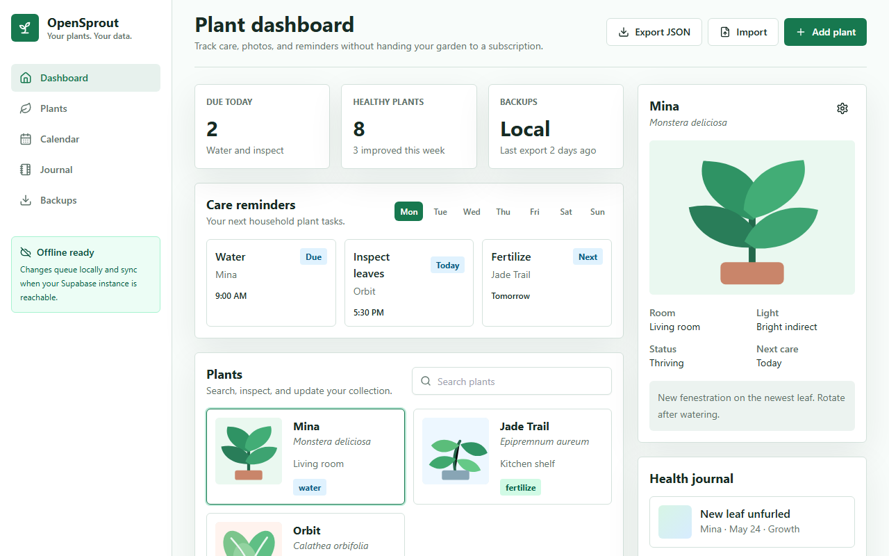

# OpenSprout


OpenSprout is a privacy-first, open-source plant care dashboard for tracking watering, fertilizing, journals, reminders, and plant health without ads, subscriptions, or data lock-in.

## Why OpenSprout?

Plant care apps should feel like useful household tools, not another subscription trying to own your data.

OpenSprout is built around three principles:

- Plant care tools should not require subscriptions.
- Gardening data should remain portable and private.
- Improvements should remain open to the community.

OpenSprout is designed to be self-hostable, PWA-first, mobile-friendly, local-first where practical, beginner-friendly, and open-source forever.

## Screenshots

### Desktop Dashboard



### Mobile Dashboard


## Features

- Responsive plant dashboard.
- Plant cards and detail panel.
- Care reminders preview.
- Health journal preview.
- Add plant demo interaction.
- Searchable plant list.
- JSON export demo.
- PWA manifest and service worker.
- Supabase/Postgres schema with RLS and private Storage policy.

## Tech Stack

- Next.js 15
- TypeScript
- Tailwind CSS
- shadcn-style UI primitives
- Supabase
- PostgreSQL
- Supabase Auth
- Supabase Storage
- Vercel-ready frontend

## Quick Start

```bash
git clone https://github.com/sparshsam/opensprout.git
cd opensprout
npm install
npm run dev
```

Then open `http://localhost:3000`.

The web app lives in `apps/web`.

## Package Scripts

```bash
npm run dev        # Start the Next.js app
npm run build      # Build for production
npm run lint       # Run ESLint
npm run typecheck  # Run TypeScript checks
```

## Environment Variables

Copy `.env.example` to `.env.local` and configure your Supabase project.

| Variable | Required | Description |
| --- | --- | --- |
| `NEXT_PUBLIC_SUPABASE_URL` | Yes | Supabase project URL used by the web app. |
| `NEXT_PUBLIC_SUPABASE_PUBLISHABLE_KEY` | Yes | Supabase publishable key for browser/server client access. |

Do not expose Supabase service role keys in the frontend.

## Supabase Setup

The initial schema is in `supabase/migrations/20260525111000_initial_schema.sql`.

It includes:

- User profiles
- Plants
- Care schedules
- Task instances
- Care logs
- Journal entries
- Journal photos
- Export/import metadata
- Sync devices
- Private `plant-photos` Storage bucket
- RLS policies for all user-owned data

Recommended local setup:

```bash
supabase start
supabase db reset
```

Then copy your local Supabase URL and publishable key into `.env.local`.

## Architecture

```text
opensprout/
├── apps/web              # Next.js 15 PWA
├── packages/ui           # Future shared UI package
├── packages/database     # Future generated database types
├── packages/shared       # Future shared domain types
├── packages/config       # Future shared tooling config
├── docs                  # Architecture, roadmap, screenshots
├── supabase/migrations   # Database schema and RLS
└── .github               # Issue templates and project organization
```

More detail is available in [docs/architecture.md](docs/architecture.md).

## Roadmap

### MVP

- Public starter repo with AGPLv3 license.
- Responsive dashboard and PWA foundation.
- Initial Supabase schema with RLS.
- Plant dashboard, reminders preview, journal preview, and JSON export demo.

### v0.2

- Real authentication flow.
- Create, edit, archive, and delete plants.
- Watering, fertilizing, pruning, and repotting logs.
- Plant detail timeline.
- Reminder scheduling and task completion.

### v1.0

- Stable self-hosting path.
- Full export/import backup flow.
- Private photo uploads.
- Offline sync queue.
- Accessibility and security review.
- Complete contributor and deployment docs.

See [docs/roadmap.md](docs/roadmap.md) for the longer release path.

## Good First Issues

- Add empty states for users with no plants.
- Add a plant profile edit form.
- Add a real care log form.
- Add unit tests for export JSON shaping.
- Add a Supabase local development guide.
- Improve mobile navigation.
- Add screenshot refresh instructions.

## Why AGPLv3?

OpenSprout is licensed under AGPLv3 to make sure improvements to hosted versions remain open to the community. Anyone can use, study, modify, and self-host the project, but public network use must preserve the same openness.

## Contributing

Contributions are welcome. See [CONTRIBUTING.md](CONTRIBUTING.md) for setup, branch, PR, and design guidance.

## Documentation

- [Architecture](docs/architecture.md)
- [Roadmap](docs/roadmap.md)
- [License notes](docs/license-notes.md)
- [Contributing](CONTRIBUTING.md)

## License

OpenSprout is licensed under the GNU Affero General Public License v3.0 or later. See [LICENSE](LICENSE).
