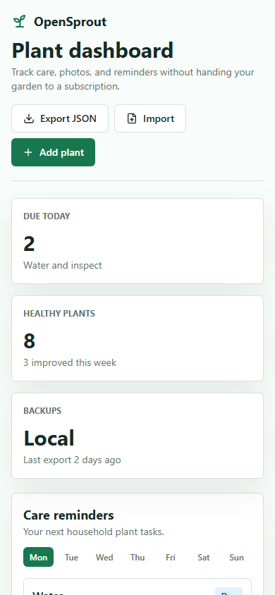
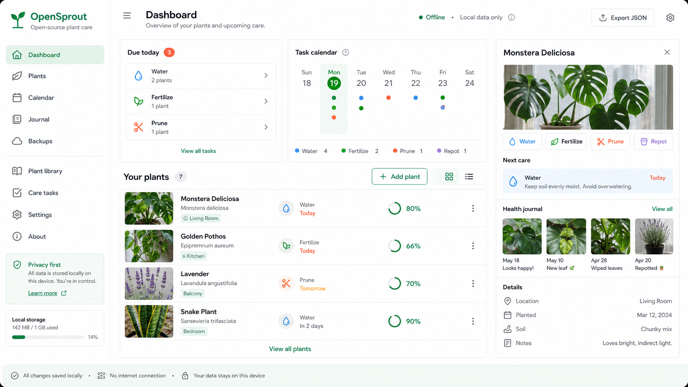
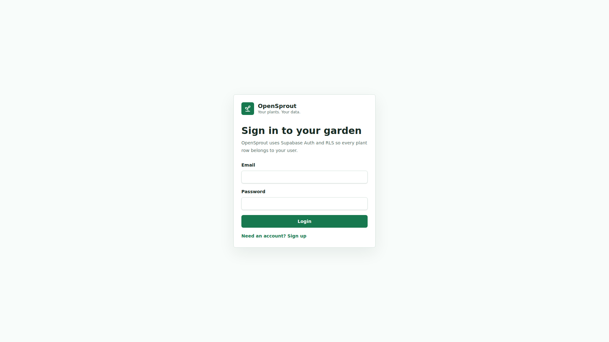
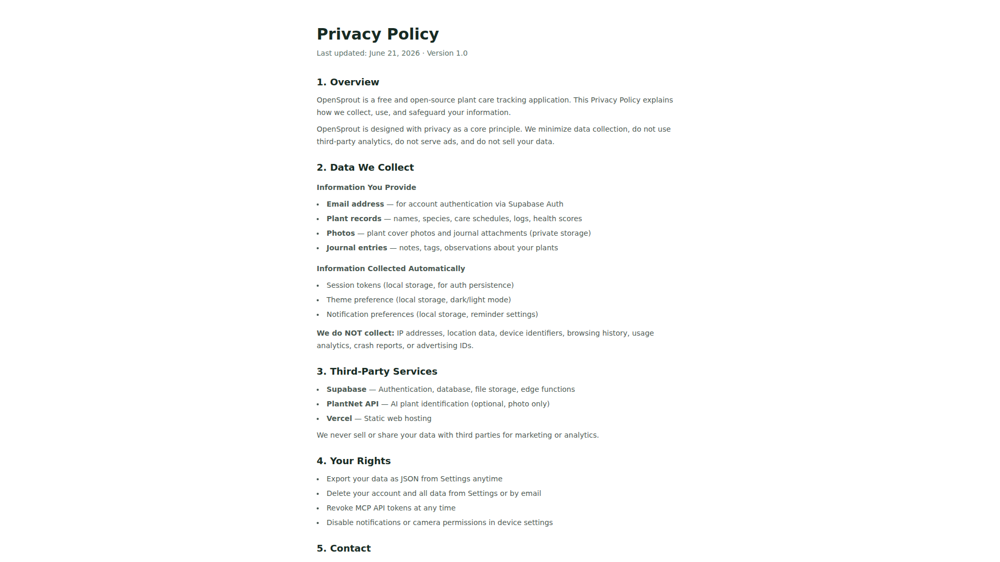

  <picture>
    <source media="(prefers-color-scheme: dark)" srcset="assets/branding/icon.png">
    
  </picture>
  <h1 align="center">OpenSprout</h1>
  

    <strong>Privacy-first plant care, open to everyone.</strong>
     
    Track plants, care schedules, watering logs, and journal entries — no subscriptions, no data lock-in.
  

   

  

 

 

---

## Gallery

  
  
  
    
  
  

 

---

## Why OpenSprout

Most plant care apps eventually become a subscription, a closed data silo, or both. OpenSprout takes a different path.

**No subscriptions.** **Portable data** — export your rows as JSON anytime. **Self-hostable** — the stack is ordinary Next.js, Supabase, and PostgreSQL. **Open improvements** — AGPLv3 keeps public hosted improvements open to the community.

 

---

## Features

| | |
|---|---|
| **Plant CRUD** — Create, edit, delete, inspect plants | **Care Templates** — 30 built-in species templates with suggested care rhythms |
| **Care Schedules** — Watering and fertilizing schedules from templates or custom inputs | **Care Logs** — Mark plants watered or fertilized and persist logs |
| **Journal Entries** — Title, body, health score, tags, optional photo attachments | **Photo Uploads** — Capture from camera or gallery, stored in private Supabase Storage |
| **JSON Export** — Export your data anytime | **Android App** — Capacitor-based native Android experience |
| **AI Agent Integration (MCP)** — 25 tools for plant management via Claude, Hermes, Cursor | **PWA** — Installable as a standalone web app |

 

---

## Designed For

**People who care for living things and want practical, private tracking.**

- **Houseplant owners** tracking watering schedules across a collection
- **Gardeners** logging seasonal care routines
- **Plant enthusiasts** journaling growth with photos and health scores

 

---

## Design Philosophy

> _"A care dashboard, not a social network."_

Every feature serves one purpose: helping you remember what your plants need. No feeds, no likes, no notifications you didn't ask for. Dark-mode first, clean typography, generous spacing. Data is yours — portable, exportable, never sold.

 

---

## Built With

  
  
  
  
  
  
  

 

---

## Version Journey

| Version | Date | Highlights |
|---------|------|------------|
| **v0.9.0** | 2026-06 | MCP server with 25 AI agent tools, photo uploads |
| **v0.8.0** | 2026-05 | Android app (Capacitor), full Android project |
| **v0.7.0** | 2026-05 | Journal entries, health scores, tag system |
| **v0.6.0** | 2026-04 | Photo uploads, plant cover photos, timeline |
| **v0.5.0** | 2026-04 | Care schedules, logging, JSON export |
| **v0.4.0** | 2026-03 | Care templates (30 built-in species) |
| **v0.3.0** | 2026-03 | Plant CRUD, species database |
| **v0.2.0** | 2026-02 | Auth, dashboard, initial stack |
| **v0.1.0** | 2026-01 | Project scaffold, Supabase schema |

[Full Changelog](CHANGELOG.md)

 

---

## License

AGPLv3 — see [LICENSE](LICENSE)

Built by [@sparshsam](https://github.com/sparshsam)

 

---

 

---

 

  <strong>Part of the Kovina Collection</strong>

  <a href="https://github.com/sparshsam/openreader">OpenReader</a> ·
  <a href="https://github.com/sparshsam/openjournal">OpenJournal</a> ·
  <a href="https://github.com/sparshsam/openledger">OpenLedger</a> ·
  <a href="https://github.com/sparshsam/opentone">OpenTone</a> ·
  <a href="https://github.com/sparshsam/openpalette">OpenPalette</a> ·
  <a href="https://github.com/sparshsam/openconvert">OpenConvert</a>

  <a href="https://github.com/sparshsam/opensnap">OpenSnap</a> ·
  <a href="https://github.com/sparshsam/worldclock-widget">WorldClock Widget</a> ·
  <a href="https://github.com/sparshsam/openproof">OpenProof</a> ·
  <a href="https://github.com/sparshsam/opensend">OpenSend</a> ·
  <a href="https://github.com/sparshsam/opensprout">OpenSprout</a>

  <a href="https://github.com/sparshsam/wordwise">WordWise</a> ·
  <a href="https://github.com/sparshsam/openscrabble">OpenScrabble</a> ·
  <a href="https://github.com/sparshsam/chess-by-sparsh">Chess by Sparsh</a> ·
  <a href="https://github.com/sparshsam/hisstastic">Hisstastic</a>

  Minimal, focused tools for everyday tasks.

