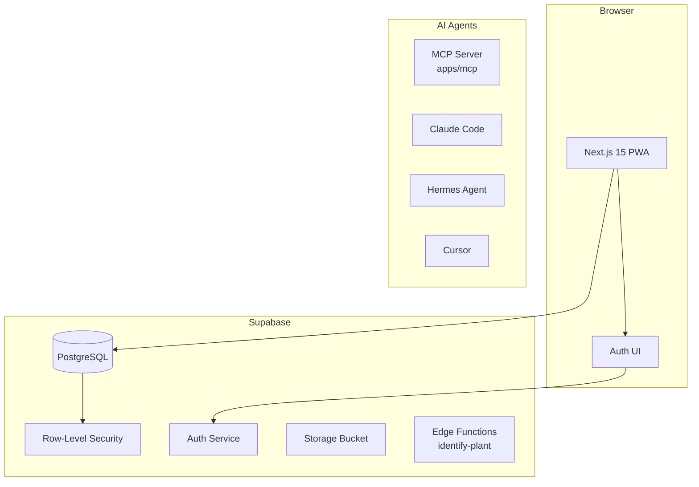

# Architecture

> Full architecture documentation at [`docs/architecture.md`](architecture.md) (existing).

## Overview

OpenSprout is a privacy-minded, open-source plant care dashboard for tracking plants, care schedules, and watering or fertilizing logs. Built with Next.js 15 + Supabase + TypeScript.

## Stack

```
Frontend:    Next.js 15 (App Router) + Tailwind CSS
Backend:     Next.js API routes (serverless functions)
Database:    Supabase PostgreSQL with Row-Level Security
Storage:     Supabase Storage (private bucket for plant photos)
Auth:        Supabase Auth (email/password)
MCP:         @modelcontextprotocol/sdk (stdio transport)
Android:     Capacitor
Deploy:      Vercel
```

## System Architecture



## Additional Resources

- [Architecture (full)](architecture.md)
- [MCP Integration](mcp-integration.md)
- [MCP Agent Prompts](mcp-agent-prompts.md)
- [MCP Reliability Audit](mcp-reliability-audit.md)
- [Roadmap](roadmap.md)
