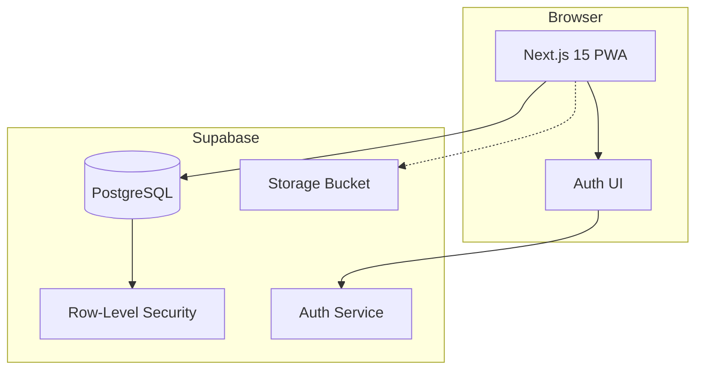
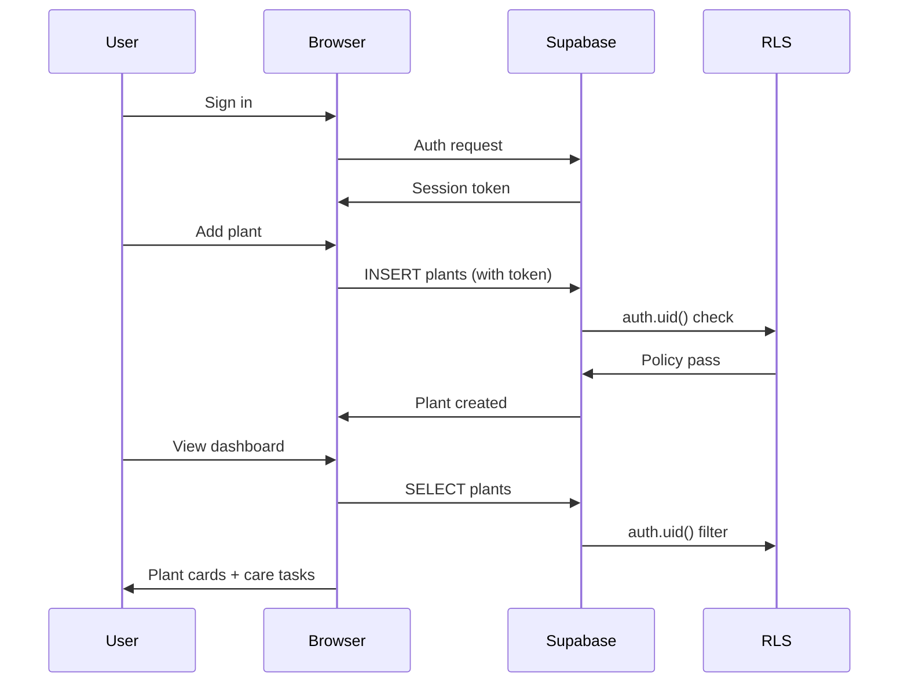
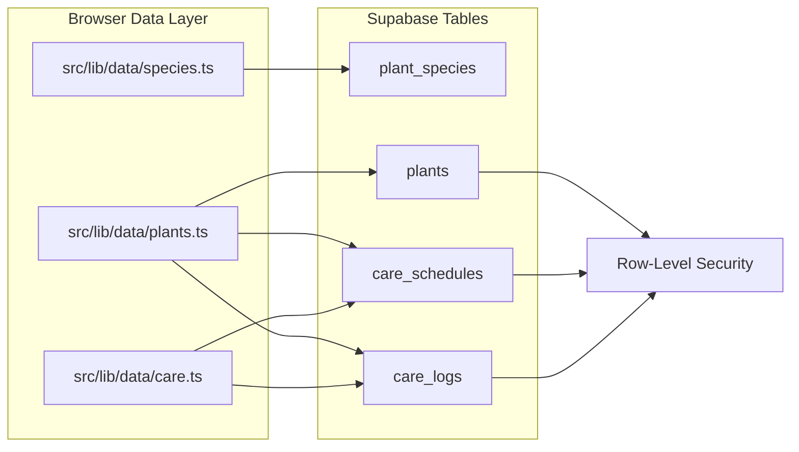

# OpenSprout Architecture

## System Overview





## Folder Architecture

```text
opensprout/
|-- apps/
|   `-- web/                  # Next.js 15 PWA
|       |-- public/           # manifest, service worker, app icons
|       `-- src/
|           |-- app/          # App Router pages and route handlers
|           |-- components/   # Product and UI components
|           `-- lib/
|               |-- data/     # Supabase query and domain helpers
|               `-- supabase/ # Browser/server clients
|-- packages/
|   |-- ui/                   # Future shared shadcn/ui package
|   |-- database/             # Future generated DB types and helpers
|   |-- shared/               # Shared domain types
|   `-- config/               # Shared lint/ts/tailwind config
|-- docs/                     # Architecture, API, roadmap, license notes
|-- supabase/
|   `-- migrations/           # PostgreSQL schema and RLS
|-- scripts/                  # Maintenance and release scripts
`-- .github/                  # Issue templates and project docs
```

## Runtime Data Flow

The dashboard uses Supabase directly from the browser with the publishable key. RLS is the security boundary, and no service role key is used in the frontend.



## API Structure

Initial route handlers live in `apps/web/src/app/api`:

- `GET /api/plants`: list the signed-in user's plants.
- `POST /api/plants`: create a plant with validated input and server-generated sync metadata.
- `GET /api/export`: export user-owned tables as portable JSON.

The current dashboard primarily uses the browser data layer in `src/lib/data`. Route handlers remain available for future server-driven flows.

Planned routes:

- `/api/care-schedules`
- `/api/care-logs`
- `/api/journal`
- `/api/photos/sign-upload`
- `/api/import`
- `/api/sync/pull`
- `/api/sync/push`

## Component Hierarchy

```text
RootLayout
`-- Home
    |-- AppShell
    |   |-- AuthPanel
    |   |-- PlantForm
    |   |-- PlantCard
    |   |-- PlantDetail
    |   |-- Care reminders
    |   `-- Recent care logs
    `-- PwaRegister
```

## Initial UI Wireframe

```text
+--------------+---------------------------------------------+-------------+
| OpenSprout   | Plant dashboard                             | Plant detail|
| Dashboard    | [Export JSON] [Import] [Add plant] [Logout] | Photo       |
| Plants       |                                             | Care buttons|
| Calendar     | Due today | Healthy plants | Backups        | Notes       |
| Journal      |                                             +-------------+
| Backups      | Care reminders from schedules               | Care logs   |
| Supabase sync|                                             | preview     |
|              | Plant search + plant list + edit form       |             |
+--------------+---------------------------------------------+-------------+
```

## Database Schema

The initial migration includes:

- `profiles`
- `plant_species`
- `plants`
- `care_schedules`
- `task_instances`
- `care_logs`
- `journal_entries`
- `journal_photos`
- `data_transfers`
- `sync_devices`
- private Supabase Storage bucket `plant-photos`

Every user-owned public table has RLS enabled. Policies use `auth.uid()` against `user_id` or `profiles.id`. Mutable tables include `client_id`, `sync_version`, `last_modified_at`, and `deleted_at` for local-first sync and tombstones.

`plant_species` is a public, read-only Care Templates table. It stores common plant guidance and suggested watering/fertilizing intervals. Plants can optionally reference `plant_species.id` through `plants.species_id`, while still preserving custom species text for plants that are not in the template list.

For the hosted OpenSprout project, the schema was applied through Supabase MCP raw SQL execution. The repo migration file remains the source of truth.
